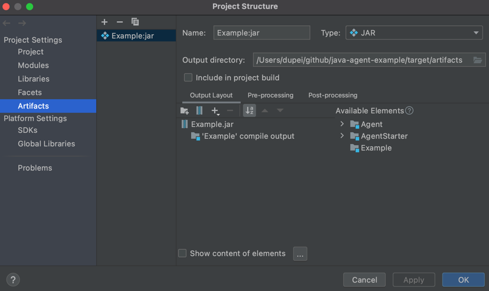

# java-agent-example
Java Agent Example Code

## 0x01 项目说明
项目分3个子项目：Example，Agent，AgentStarter。

其中，Example是一个简易的程序，是被修改的目标程序； Agent是注入到Example应用中的模块，负责修改指定的内容；AgentStarter是负责将Agent注入到Example的工具。

将Example和AgentStarter打包生成可执行的jar，Agent则是一个agent模块。

```bash
$ java -jar ./Example.jar
bird say hello.
bird say hello.
bird say hello.
bird say hello.
bird say hello.
bird say hello.
bird say hello.
Class changed!
bird is gone.
bird is gone.
bird is gone.
bird is gone.
bird is gone.
bird is gone.
bird is gone.
```

## 0x02 其他
IDEA上生成可执行jar，需要做一些配置，如下：
File -> Project Structures...

然后，Build -> Build Artifacts...

需要注意一下，Agent生成的MANIFEST文件需要修改一下，如下：
```
Manifest-Version: 1.0
Agent-Class: AgentEntry
Can-Retransform-Classes: true
```